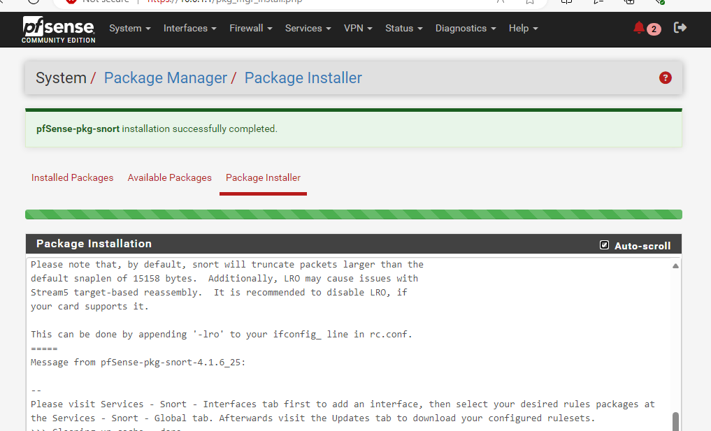

# Enterprise Security Lab – Part 1.5: Snort IDS/IPS Deployment

## 1. Overview
This project builds upon the enterprise lab created in [Project 1 (Lab Setup)](https://github.com/<your-username>/enterprise-lab-part1-setup).  
The focus here is deploying **Snort** as both an Intrusion Detection System (IDS) and Intrusion Prevention System (IPS) on the pfSense firewall for the **ECORP LAN** interface.  

By the end of this project, Snort is configured to:
- Detect and alert on suspicious traffic (ICMP pings, potential malware downloaders, PE executables, etc.)
- Block offending traffic when switched to IPS mode
- Leverage both custom rules and prebuilt rule sets (Snort VRT, GPLv2 Community, ET, FEODO rules)

---

## 2. Skills Demonstrated
- **IDS/IPS Configuration:** Installed and configured Snort on pfSense  
- **Custom Rule Creation:** Built custom detection rules for ICMP traffic, malware downloads, and PE executables  
- **Traffic Testing & Validation:** Used Kali Linux, Python web server, and crafted payloads to trigger Snort alerts  
- **IPS Mode Tuning:** Transitioned Snort from IDS (alert only) to IPS (block offenders)  
- **Security Operations:** Integrated prebuilt rule sets to expand detection capabilities  

---

## 3. Environment
- **pfSense Firewall:** Hosts Snort, monitors ECORP LAN interface  
- **Windows 11 Client:** Used to generate benign/malicious traffic (pings, downloads)  
- **Kali Linux (Attack VM):** Used to create payloads and host malicious web server for testing  
- **Snort Prebuilt Rules:** VRT, GPLv2 Community, ET, and FEODO rules enabled  

---

## 4. Steps and Screenshots

### 4.1 Installing Snort on pfSense
1. Logged into pfSense from Windows 11.
2. Navigated to the **Package Manager** and installed Snort.  
   

3. Verified successful installation:  
   

4. Added Snort interface for **ECORP LAN** in the interface settings:  
   

5. Confirmed ECORP LAN interface was active under Snort:  
   

---

### 4.2 Creating Custom ICMP Rule
1. Added a custom rule on the ECORP LAN interface to alert on outbound ICMP (ping) traffic:  
   ```snort
   alert icmp HOME_NET any -> EXTERNAL_NET any (msg:"Ping detected"; sid:1000001;)
