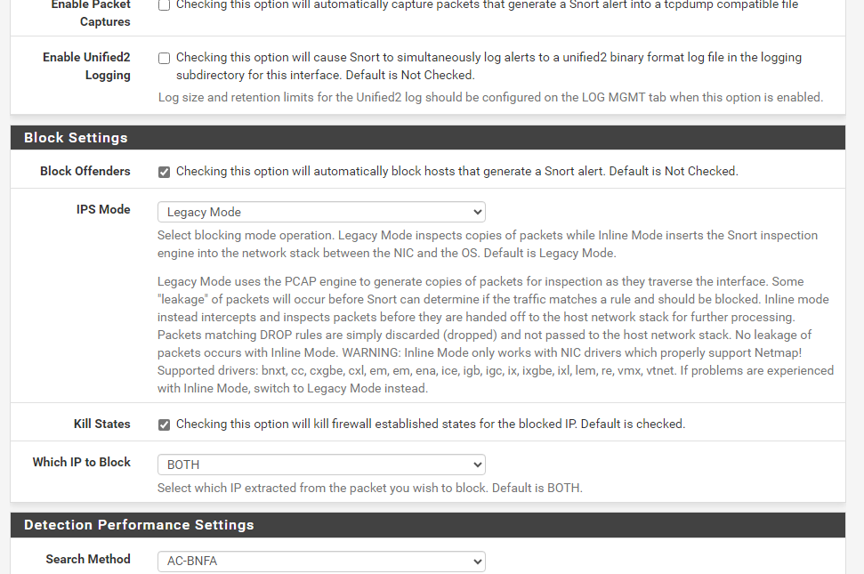

# Enterprise Security Lab – Part 1.1: Snort IDS/IPS Deployment

## 1. Overview

This project builds upon the enterprise lab created in Project 1 (Lab Setup). The focus is deploying Snort as both an Intrusion Detection System (IDS) and Intrusion Prevention System (IPS) on the pfSense firewall for the ECORP LAN interface.

Key objectives:
- Install and configure Snort on pfSense
- Write and test custom detection rules
- Validate alerts with controlled attacks and test traffic
- Transition from IDS mode (alert-only) to IPS mode (block offenders)
- Enable and tune prebuilt rule sets (Snort VRT, GPLv2 Community, ET, FEODO)

---

## 2. Skills Demonstrated

IDS/IPS Deployment: Installed and configured Snort in pfSense, bound to ECORP LAN  
Rule Development: Built custom detection rules for ICMP, malware downloads, and PE executables  
Traffic Simulation: Generated controlled malicious traffic using Kali Linux, Python web server, and Metasploit  
Troubleshooting: Tuned Snort HOME_NET/EXTERNAL_NET variables and rule directions to catch missed detections  
IPS Enforcement: Enabled Block Offenders to actively stop malicious traffic in real-time  

---

## 3. Environment

pfSense Firewall: Hosts Snort and enforces IPS actions  
Windows 11 Client: Generates benign and malicious traffic (pings, downloads)  
Kali Linux (Attack VM): Generates payloads and hosts malicious web server  
Snort Rule Sets Enabled: Snort VRT, GPLv2 Community Rules, Emerging Threats (ET), FEODO Tracker  

---

## 4. Steps and Testing

### 4.1 Installing Snort on pfSense

Snort was installed via the pfSense Package Manager.  

The ECORP LAN interface was added to Snort.  

Verified Snort was active and monitoring the ECORP LAN.  

---

### 4.2 Writing and Testing ICMP (Ping) Detection Rule

A custom ICMP detection rule was created.  

---

#### ICMP Ping to 1.1.1.1

A ping was sent to 1.1.1.1 from Windows 11.  
Result: The alert triggered as expected.  

---

#### ICMP Ping to 8.8.8.8 (Initial)

A ping was sent to 8.8.8.8.  
Result: No alert triggered, revealing an issue with HOME_NET/EXTERNAL_NET variables.  

The rule was updated for broader coverage (screenshot of updated rule).  

After re-testing with 8.8.8.8, all ICMP traffic triggered alerts.  

IPS Mode was then enabled. Pings were re-tested and were blocked after the first packet.  

---

### 4.3 HTTP Malware Downloader Rule

A custom rule was created to detect `.exe` file downloads over HTTP (see screenshot).  

A malicious payload was generated using Kali Linux.  

The payload was hosted on a Python web server.  

The payload was downloaded from Windows 11.  
Result: The alert fired immediately when the `.exe` was requested.  

---

### 4.4 PE Executable Magic Number Detection

The payload was renamed from `.exe` to `.txt` to bypass filename-based detection.  

A new rule was created to detect PE executable magic numbers in the payload (see screenshot).  

The renamed payload was downloaded.  
Result: Snort detected the PE signature and generated an alert.  

---

### 4.5 Enabling Prebuilt Rule Sets

The following prebuilt rule sets were enabled:  
- Snort VRT  
- GPLv2 Community  
- Emerging Threats (ET)  
- FEODO Tracker  

---

## 5. Results

- Successfully installed and configured Snort as IDS and IPS  
- Validated multiple detection rules: ICMP, `.exe` downloads, PE magic numbers  
- Learned how rule directionality and variables (HOME_NET/EXTERNAL_NET) impact detection  
- Practiced troubleshooting when alerts didn’t fire as expected  
- Observed IPS blocking behavior and learned how to tune block lists  

---

